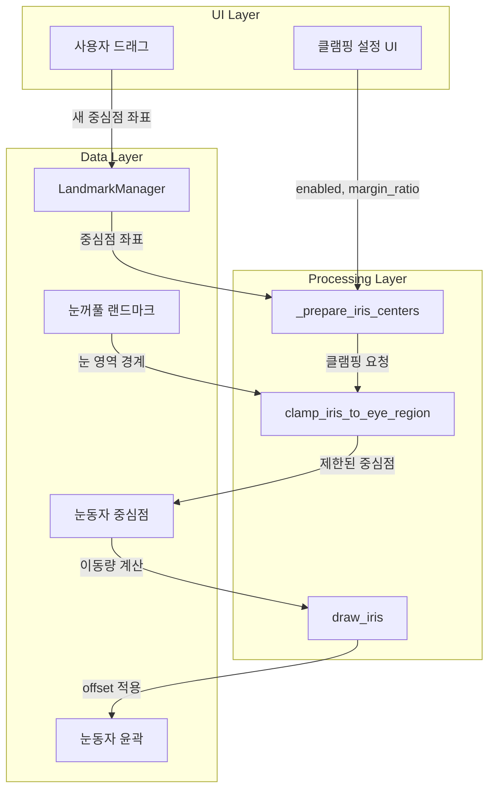
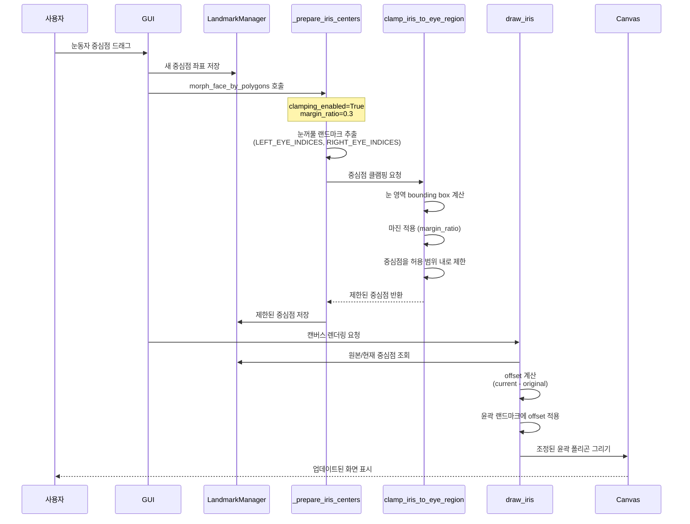

# 눈동자 윤곽과 눈꺼풀 랜드마크 연동 시스템

## 1. 개요

본 문서는 얼굴 편집 시스템에서 눈동자 윤곽(Iris Contour)과 눈꺼풀 랜드마크(Eyelid Landmarks)의 연동 메커니즘을 설명합니다. 이 시스템은 사용자가 눈동자 중심점을 드래그할 때 눈동자 윤곽이 자연스럽게 이동하면서도 눈꺼풀 영역을 벗어나지 않도록 제한하는 기능을 제공합니다.

### 주요 기능

- **눈동자 중심점 드래그**: 사용자가 눈동자 중심점을 드래그하여 눈동자 위치 조정
- **윤곽 자동 이동**: 중심점 이동 시 눈동자 윤곽(8개 포인트)이 함께 평행이동
- **눈꺼풀 경계 제한**: 눈동자 중심점이 눈꺼풀 영역을 벗어나지 않도록 클램핑
- **UI 제어**: 클램핑 활성화 여부 및 마진 비율을 UI에서 실시간 조절

## 2. 시스템 아키텍처

### 2.1 눈동자 포인트 구조

MediaPipe Face Mesh는 총 478개의 랜드마크를 제공하며, 이 중 눈동자 관련 포인트는 10개입니다:

```
눈동자 포인트 (총 10개)
├── 눈동자 윤곽 (Iris Contour): 8개
│   ├── 왼쪽 눈동자: [474, 475, 476, 477] (4개)
│   └── 오른쪽 눈동자: [469, 470, 471, 472] (4개)
└── 눈동자 중심점 (Iris Center): 2개
    ├── 왼쪽 중심: 468
    └── 오른쪽 중심: 473
```

**참고**: MediaPipe의 LEFT/RIGHT는 이미지 기준이므로, 사용자 관점에서는 반대입니다.
- MediaPipe LEFT_IRIS (468, 474-477) = 이미지 오른쪽 = 사용자 왼쪽
- MediaPipe RIGHT_IRIS (473, 469-472) = 이미지 왼쪽 = 사용자 오른쪽

### 2.2 핵심 컴포넌트



### 2.3 데이터 흐름



## 3. 핵심 구현 상세

### 3.1 클램핑 메커니즘

**파일**: `utils/face_morphing/polygon_morphing/core.py`

#### `clamp_iris_to_eye_region()` 함수

눈동자 중심점을 눈꺼풀 영역 내로 제한하는 핵심 함수입니다.

```python
def clamp_iris_to_eye_region(iris_center_coord, eye_landmarks, img_width, img_height, 
                             margin_ratio=0.3, clamping_enabled=True):
    """눈동자 중심점을 눈 영역 내로 제한
    
    Args:
        iris_center_coord: 눈동자 중심점 좌표 (x, y)
        eye_landmarks: 눈 랜드마크 포인트 리스트 [(x, y), ...]
        img_width: 이미지 너비
        img_height: 이미지 높이
        margin_ratio: 눈 영역 마진 비율 (0.0 ~ 1.0, 기본값 0.3)
        clamping_enabled: 클램핑 활성화 여부 (기본값 True)
    
    Returns:
        (x, y): 제한된 눈동자 중심점 좌표
    """
```

**알고리즘**:

1. **눈 영역 Bounding Box 계산**
   ```python
   min_x = min(x_coords)
   min_y = min(y_coords)
   max_x = max(x_coords)
   max_y = max(y_coords)
   ```

2. **마진 계산 및 적용**
   ```python
   width = max_x - min_x
   height = max_y - min_y
   margin_x = width * margin_ratio
   margin_y = height * margin_ratio
   
   clamped_min_x = max(0, min_x - margin_x)
   clamped_min_y = max(0, min_y - margin_y)
   clamped_max_x = min(img_width, max_x + margin_x)
   clamped_max_y = min(img_height, max_y + margin_y)
   ```

3. **중심점 클램핑**
   ```python
   clamped_x = max(clamped_min_x, min(clamped_max_x, iris_center_coord[0]))
   clamped_y = max(clamped_min_y, min(clamped_max_y, iris_center_coord[1]))
   ```

**마진 비율 효과**:
- `margin_ratio = 0.0`: 눈 영역 경계에 딱 맞춤 (가장 제한적)
- `margin_ratio = 0.3`: 눈 영역의 30% 여유 공간 허용 (기본값)
- `margin_ratio = 1.0`: 눈 영역의 100% 여유 공간 허용 (가장 자유로움)

### 3.2 눈동자 포인트 전처리

**파일**: `utils/face_morphing/polygon_morphing/core.py`

#### `_prepare_iris_centers()` 함수

눈동자 포인트를 처리하고 중앙 포인트를 준비하는 함수입니다.

```python
def _prepare_iris_centers(original_landmarks, transformed_landmarks,
                         left_iris_center_coord, right_iris_center_coord,
                         left_iris_center_orig, right_iris_center_orig,
                         img_width, img_height, clamping_enabled=True, margin_ratio=0.3):
    """눈동자 포인트 처리 및 중앙 포인트 준비
    
    Returns:
        tuple: (original_landmarks_no_iris, transformed_landmarks_no_iris,
                original_points_array, transformed_points_array, iris_indices)
    """
```

**주요 처리 단계**:

1. **랜드마크 길이 확인 및 눈동자 포인트 제거**
   - 478개 랜드마크 → 468개로 변환 (눈동자 10개 제거)
   - 이미 468개인 경우 그대로 사용

2. **눈동자 중심점 계산 또는 전달받은 좌표 사용**
   - 드래그로 변경된 좌표가 있으면 사용
   - 없으면 윤곽 포인트의 평균으로 계산

3. **클램핑 적용** (라인 327-336)
   ```python
   if clamping_enabled:
       from utils.face_landmarks import LEFT_EYE_INDICES, RIGHT_EYE_INDICES
       
       # 왼쪽 눈 랜드마크 추출
       left_eye_landmarks = [transformed_landmarks_tuple[idx] 
                            for idx in LEFT_EYE_INDICES]
       
       # 클램핑 적용
       left_iris_center_trans = clamp_iris_to_eye_region(
           left_iris_center_trans, left_eye_landmarks, img_width, img_height,
           margin_ratio=margin_ratio, clamping_enabled=clamping_enabled
       )
   ```

4. **변환된 랜드마크 리스트 생성**
   - 눈동자 포인트가 제거된 468개 랜드마크 + 2개 중심점 = 470개

### 3.3 윤곽 이동 메커니즘

**파일**: `gui/face_edit/polygon_renderer/all_tab_drawer.py`

#### `draw_iris()` 함수 (내부 함수)

눈동자 윤곽을 캔버스에 그리는 함수입니다.

**알고리즘**:

1. **현재 및 원본 중심점 조회** (라인 291-303)
   ```python
   current_iris_center_coord = None
   if iris_centers is not None and len(iris_centers) == 2:
       if iris_side == 'left':
           current_iris_center_coord = iris_centers[1]
       else:
           current_iris_center_coord = iris_centers[0]
   
   original_iris_center_coord = self.landmark_manager.get_original_left_iris_center_coord()
   ```

2. **이동량(Offset) 계산** (라인 305-308)
   ```python
   offset_x, offset_y = 0, 0
   if current_iris_center_coord and original_iris_center_coord:
       offset_x = current_iris_center_coord[0] - original_iris_center_coord[0]
       offset_y = current_iris_center_coord[1] - original_iris_center_coord[1]
   ```

3. **윤곽 랜드마크에 Offset 적용** (라인 310-326)
   ```python
   adjusted_landmarks_iris = []
   iris_connections_indices = set()
   for idx1, idx2 in iris_connections:
       iris_connections_indices.add(idx1)
       iris_connections_indices.add(idx2)
   
   for i, pt in enumerate(landmarks):
       if i in iris_connections_indices:  # 눈동자 윤곽 랜드마크에만 적용
           if isinstance(pt, tuple):
               adjusted_landmarks_iris.append((pt[0] + offset_x, pt[1] + offset_y))
           # ... (다른 타입 처리)
       else:
           adjusted_landmarks_iris.append(pt)
   ```

4. **폴리곤 생성 및 렌더링** (라인 328-341)
   ```python
   iris_points = self._get_polygon_from_indices(
       [], adjusted_landmarks_iris, img_width, img_height, scale_x, scale_y, pos_x, pos_y,
       use_mediapipe_connections=True, connections=iris_connections, expansion_level=0
   )
   
   if iris_points and len(iris_points) >= 3:
       polygon_id = canvas.create_polygon(
           iris_points,
           fill="",
           outline=color,
           width=2,
           tags=("landmarks_polygon", f"polygon_{iris_side}_iris")
       )
   ```

**특징**:
- **평행이동 방식**: 모든 윤곽 포인트에 동일한 offset 적용
- **형태 유지**: 원형/타원형 등 원래 형태 그대로 유지
- **실시간 렌더링**: 드래그 중에도 즉시 반영

## 4. UI 연동

### 4.1 클램핑 설정 UI

**파일**: `gui/face_edit/__init__.py`

#### 전역 변수 (모든 탭에서 공유)

```python
# 눈동자 이동 범위 제한 설정 (라인 91-92)
self.iris_clamping_enabled = tk.BooleanVar(value=True)
self.iris_clamping_margin_ratio = tk.DoubleVar(value=0.3)
```

**중요**: 이 변수들은 **전역으로 공유**되므로, 어느 탭에서 변경하든 모든 탭에 적용됩니다.

#### UI 위치: 눈동자(Iris) 탭

**파일**: `gui/face_edit/slider_ui.py` (라인 1111-1195)

눈동자 클램핑 설정 UI는 **눈동자 탭에** 존재합니다. 눈동자 관련 모든 설정이 한 곳에 모여 있어 사용자가 눈동자 작업 중 바로 설정을 조절할 수 있습니다.

**UI 컴포넌트**:

1. **클램핑 활성화 체크박스**
   ```python
   tk.Checkbutton(
       iris_clamping_frame,
       text="눈동자 이동 범위 제한 활성화",
       variable=self.iris_clamping_enabled,
       command=self.on_morphing_change
   )
   ```

2. **마진 비율 슬라이더**
   ```python
   create_margin_slider(
       iris_clamping_frame,
       "제한 마진 비율:",
       self.iris_clamping_margin_ratio,
       0.0,      # 최소값
       1.0,      # 최대값
       0.01,     # 해상도
       "0.3"     # 기본값 표시
   )
   ```

#### 탭 간 설정 공유

- **눈동자 탭에서 설정** → 전체 탭, 눈 탭 등 모든 탭에 자동 적용
- **전체 탭에서 눈동자 드래그** → 눈동자 탭에서 설정한 `margin_ratio` 값 사용
- **설정 변경 시** → `self.on_morphing_change()` 호출로 즉시 반영

### 4.2 설정 전달

모핑 함수 호출 시 UI 설정값 전달 (라인 1077-1078):

```python
morph_face_by_polygons(
    # ... 다른 파라미터들
    clamping_enabled=self.iris_clamping_enabled.get(),
    margin_ratio=self.iris_clamping_margin_ratio.get(),
    # ...
)
```

## 5. 주요 함수 레퍼런스

### 5.1 `clamp_iris_to_eye_region()`

**위치**: `utils/face_morphing/polygon_morphing/core.py:83-129`

**목적**: 눈동자 중심점을 눈꺼풀 영역 내로 제한

**파라미터**:
- `iris_center_coord` (tuple): 눈동자 중심점 좌표 (x, y)
- `eye_landmarks` (list): 눈 랜드마크 포인트 리스트 [(x, y), ...]
- `img_width` (int): 이미지 너비
- `img_height` (int): 이미지 높이
- `margin_ratio` (float): 눈 영역 마진 비율 (0.0 ~ 1.0, 기본값: 0.3)
- `clamping_enabled` (bool): 클램핑 활성화 여부 (기본값: True)

**반환값**: `(x, y)` - 제한된 눈동자 중심점 좌표

**사용 예시**:
```python
clamped_center = clamp_iris_to_eye_region(
    iris_center_coord=(150, 200),
    eye_landmarks=left_eye_landmarks,
    img_width=640,
    img_height=480,
    margin_ratio=0.3,
    clamping_enabled=True
)
```

### 5.2 `_prepare_iris_centers()`

**위치**: `utils/face_morphing/polygon_morphing/core.py:132-360`

**목적**: 눈동자 포인트 처리 및 중앙 포인트 준비

**파라미터**:
- `original_landmarks` (list): 원본 랜드마크 포인트 리스트
- `transformed_landmarks` (list): 변형된 랜드마크 포인트 리스트
- `left_iris_center_coord` (tuple): 왼쪽 눈동자 중앙 포인트 좌표 (변형된)
- `right_iris_center_coord` (tuple): 오른쪽 눈동자 중앙 포인트 좌표 (변형된)
- `left_iris_center_orig` (tuple): 왼쪽 눈동자 중앙 포인트 좌표 (원본)
- `right_iris_center_orig` (tuple): 오른쪽 눈동자 중앙 포인트 좌표 (원본)
- `img_width` (int): 이미지 너비
- `img_height` (int): 이미지 높이
- `clamping_enabled` (bool): 클램핑 활성화 여부 (기본값: True)
- `margin_ratio` (float): 마진 비율 (기본값: 0.3)

**반환값**: 
```python
(
    original_landmarks_no_iris,      # 눈동자 제거된 원본 랜드마크 (468개)
    transformed_landmarks_no_iris,   # 눈동자 제거된 변형 랜드마크 (468개)
    original_points_array,           # numpy 배열 (470개: 468 + 2 중심점)
    transformed_points_array,        # numpy 배열 (470개: 468 + 2 중심점)
    iris_indices                     # 눈동자 인덱스 집합 (10개)
)
```

### 5.3 `draw_iris()` (내부 함수)

**위치**: `gui/face_edit/polygon_renderer/all_tab_drawer.py:261-400`

**목적**: 눈동자 윤곽을 캔버스에 렌더링

**파라미터**:
- `iris_side` (str): 'left' 또는 'right'
- `iris_connections` (list): 눈동자 연결 정보
- `iris_center_coord_attr` (str): 중앙 포인트 좌표 속성명

**처리 흐름**:
1. 현재 및 원본 중심점 조회
2. 이동량(offset) 계산
3. 윤곽 랜드마크에 offset 적용
4. 폴리곤 생성 및 캔버스에 그리기

### 5.4 `get_iris_indices()`

**위치**: `utils/face_morphing/region_extraction.py:8-35`

**목적**: MediaPipe 눈동자 인덱스 반환 (공통 유틸리티 함수)

**반환값**: `(left_iris_indices, right_iris_indices)` - 왼쪽/오른쪽 눈동자 인덱스 리스트 튜플

**사용 예시**:
```python
from utils.face_morphing.region_extraction import get_iris_indices

left_iris_indices, right_iris_indices = get_iris_indices()
# left_iris_indices = [474, 475, 476, 477]
# right_iris_indices = [469, 470, 471, 472]
```

## 6. 사용 예시

### 6.1 기본 사용

1. **얼굴 이미지 로드**
2. **랜드마크 감지** (MediaPipe Face Mesh, refine_landmarks=True)
3. **눈동자 중심점 드래그**
   - 캔버스에서 눈동자 중심점을 마우스로 드래그
   - 새로운 좌표가 `LandmarkManager`에 저장됨
4. **자동 처리**
   - 클램핑 적용: 중심점이 눈꺼풀 영역 내로 제한됨
   - 윤곽 이동: 윤곽 랜드마크에 offset 적용
   - 렌더링: 업데이트된 눈동자 표시

### 6.2 클램핑 설정 조절

**UI 위치**: **눈동자(Iris) 탭**의 "눈동자 이동 범위 제한" 섹션

**조절 방법**:
1. 눈동자 탭으로 이동 (또는 눈동자 작업 중 같은 탭에서)
2. "눈동자 이동 범위 제한 활성화" 체크박스: 클램핑 ON/OFF
3. "제한 마진 비율" 슬라이더: 0.0 (제한적) ~ 1.0 (자유로움)

**설정 효과** (모든 탭에 적용):
- `margin_ratio = 0.0`: 눈동자가 눈 영역 경계에 딱 맞춤
- `margin_ratio = 0.3` (기본값): 적당한 여유 공간
- `margin_ratio = 1.0`: 눈 영역의 2배 범위까지 허용

**참고**: 눈동자 탭에서 설정을 변경하면 전체 탭, 눈 탭 등 모든 탭에서 동일하게 적용됩니다.

### 6.3 프로그래밍 방식 사용

```python
from utils.face_morphing.polygon_morphing.core import morph_face_by_polygons

# 눈동자 중심점 설정
left_iris_center = (150, 200)
right_iris_center = (490, 200)

# 모핑 실행 (클램핑 포함)
morphed_image = morph_face_by_polygons(
    image=original_image,
    original_landmarks=original_landmarks,
    transformed_landmarks=transformed_landmarks,
    left_iris_center_coord=left_iris_center,
    right_iris_center_coord=right_iris_center,
    left_iris_center_orig=original_left_center,
    right_iris_center_orig=original_right_center,
    clamping_enabled=True,
    margin_ratio=0.3
)
```

## 7. 제한사항 및 개선 방향

### 7.1 현재 방식의 제한사항

1. **단순 평행이동 방식**
   - 윤곽 포인트에 동일한 offset만 적용
   - 눈꺼풀의 형태 변화에 따른 동적 재조정 없음

2. **형태 변형 미지원**
   - 윤곽 크기 조절 불가
   - 타원형 비율 조정 불가

3. **눈꺼풀 변형 시 연동 제한**
   - 눈꺼풀 랜드마크가 크게 변형되어도 윤곽은 단순 평행이동만 수행
   - 눈꺼풀 크기에 맞춰 윤곽 크기가 조절되지 않음

### 7.2 향후 개선 방향

1. **동적 윤곽 재계산**
   - 눈꺼풀 크기/형태 변화에 따라 윤곽 크기 자동 조절
   - 눈꺼풀 경계에 맞춰 윤곽 형태 동적 변형

2. **고급 클램핑 옵션**
   - 타원형 클램핑 (현재는 직사각형 bounding box 기반)
   - 눈꺼풀 폴리곤 내부 여부 정밀 검사

3. **UI 개선**
   - 윤곽 크기 조절 슬라이더 추가
   - 실시간 프리뷰 강화

## 8. 관련 파일

### 핵심 파일
- `utils/face_morphing/polygon_morphing/core.py`: 클램핑 및 전처리 로직
- `gui/face_edit/polygon_renderer/all_tab_drawer.py`: 윤곽 렌더링
- `gui/face_edit/__init__.py`: UI 설정 및 연동
- `utils/face_morphing/region_extraction.py`: 눈동자 인덱스 유틸리티

### 관련 파일
- `utils/face_landmarks.py`: 눈꺼풀 랜드마크 인덱스 정의
- `gui/face_edit/landmark_display.py`: 랜드마크 표시
- `utils/face_morphing/integration.py`: 모핑 통합 함수

## 9. 참고 자료

- [MediaPipe Face Mesh](https://google.github.io/mediapipe/solutions/face_mesh.html)
- [MediaPipe Face Mesh Landmarks](https://github.com/google/mediapipe/blob/master/mediapipe/modules/face_geometry/data/canonical_face_model_uv_visualization.png)
- Task 문서: `specs/task260123_1954.md` - 눈동자 이동 방식 개선

---

**작성일**: 2026-01-24  
**버전**: 1.0  
**작성자**: AI Assistant
